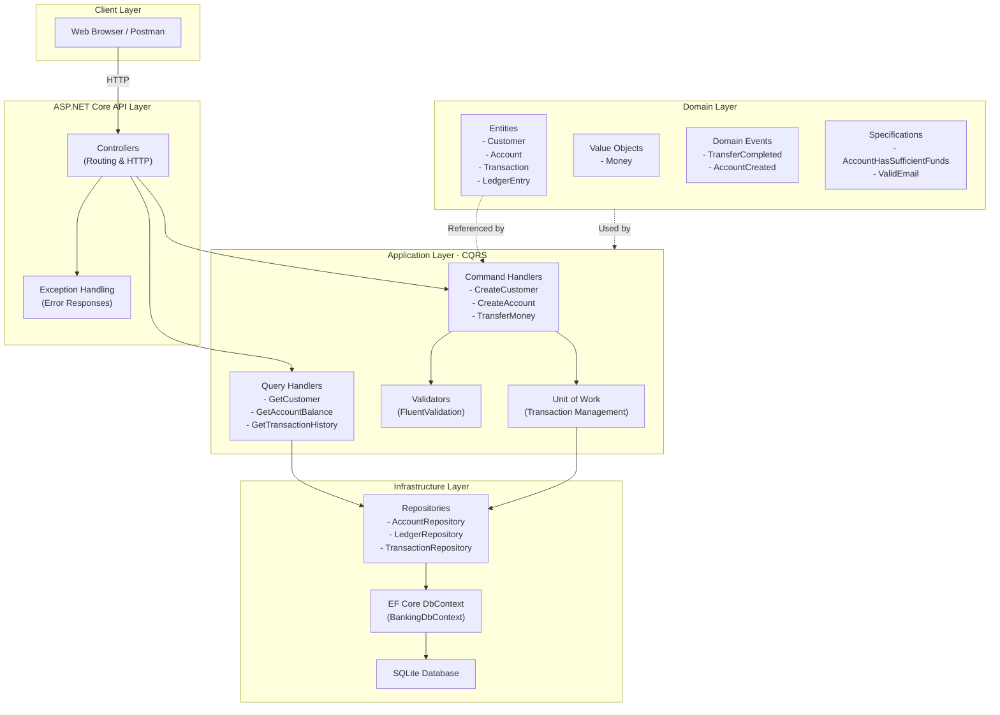
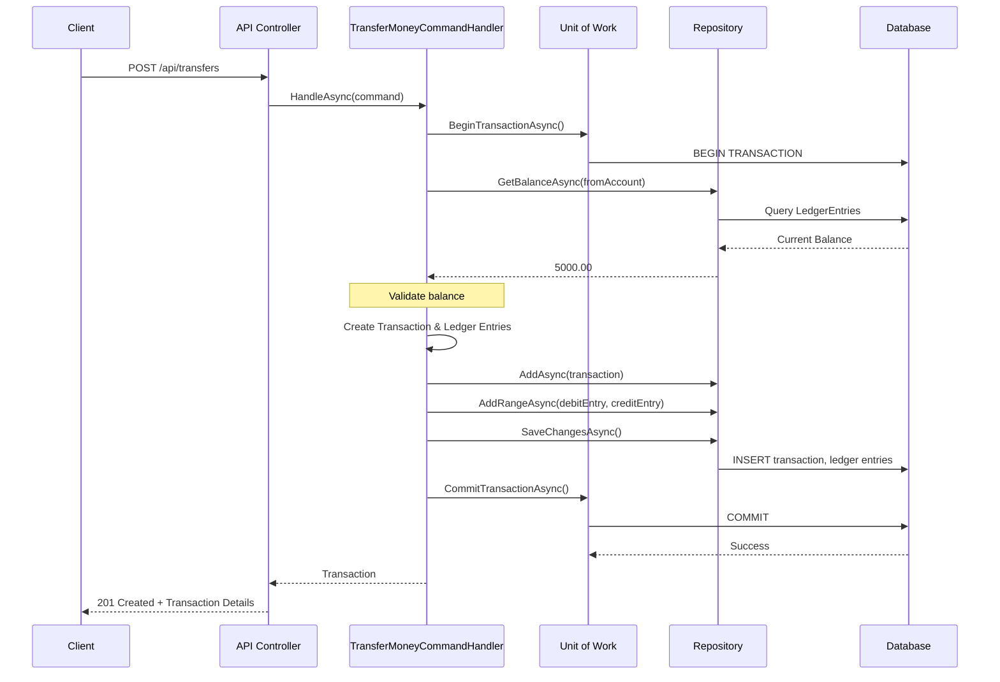
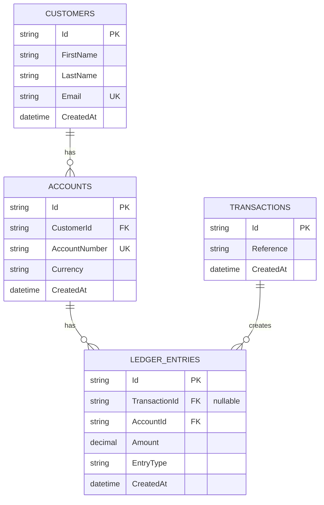

# Banking App API

A modern, production-ready banking application built with ASP.NET Core 10.0, featuring comprehensive account management, money transfer capabilities, and complete transaction history tracking.

## Overview

This is a full-stack banking application that demonstrates clean architecture principles, CQRS pattern implementation, and enterprise-grade error handling. The API provides secure endpoints for customer management, account operations, and inter-account transfers with double-entry bookkeeping ledger support.

### Key Features

- ✅ **Customer Management** - Create and retrieve customer profiles
- ✅ **Account Management** - Create accounts with optional initial balance
- ✅ **Money Transfers** - Atomic transfer operations between accounts with race condition prevention
- ✅ **Transaction History** - Paginated ledger entries with deterministic sorting
- ✅ **Balance Queries** - Real-time account balance calculations
- ✅ **Double-Entry Bookkeeping** - Complete audit trail via ledger entries
- ✅ **Transaction Safety** - Database transactions ensure data consistency
- ✅ **Interactive API Documentation** - ReDoc interface for testing endpoints
- ✅ **Banking-Grade Error Handling** - 18 domain-specific error codes with HTTP status codes
- ✅ **Production-Ready** - Clean architecture, comprehensive documentation, zero build warnings

---

## Architecture

### API Architecture



### Data Flow - Money Transfer Example



---

## Database Schema



### Schema Details

**CUSTOMERS Table**
- `Id` (GUID) - Primary key
- `FirstName` (TEXT) - Customer's first name
- `LastName` (TEXT) - Customer's last name
- `Email` (TEXT) - Unique email address
- `CreatedAt` (DATETIME) - Timestamp

**ACCOUNTS Table**
- `Id` (GUID) - Primary key
- `CustomerId` (GUID) - Foreign key to Customers
- `AccountNumber` (TEXT) - Unique account number
- `Currency` (TEXT) - ISO 4217 currency code (default: USD)
- `CreatedAt` (DATETIME) - Timestamp

**TRANSACTIONS Table**
- `Id` (GUID) - Primary key
- `Reference` (TEXT) - Transaction reference
- `CreatedAt` (DATETIME) - Timestamp

**LEDGER_ENTRIES Table**
- `Id` (GUID) - Primary key
- `TransactionId` (GUID) - Foreign key to Transactions (nullable for initial balances)
- `AccountId` (GUID) - Foreign key to Accounts
- `Amount` (DECIMAL) - Entry amount
- `EntryType` (TEXT) - "Debit" or "Credit"
- `CreatedAt` (DATETIME) - Timestamp

---

## Error Handling

The API implements a comprehensive, production-grade error handling system with banking-specific error codes.

### HTTP Status Codes

| Code | Meaning | Banking Example |
|------|---------|-----------------|
| **200** | Request succeeded | Fetch account balance |
| **201** | Resource created | New bank account created |
| **206** | Partial data | Paginated transactions |
| **400** | Bad request | Invalid transfer amount |
| **404** | Not found | Account does not exist |
| **409** | Conflict | Duplicate account number |
| **422** | Unprocessable entity | Insufficient funds |
| **500** | Server error | Unexpected exception |

### Banking Error Codes

Every error response includes a domain-specific error code (in addition to HTTP status):

| Code | Meaning | HTTP Status |
|------|---------|------------|
| 4000 | Validation failed | 400 |
| 4001 | Account not found | 404 |
| 4003 | Duplicate account number | 409 |
| 4004 | Account frozen | 422 |
| 4005 | Insufficient funds | 422 |
| 4006 | Invalid transfer amount | 400 |
| 4008 | Currency mismatch | 422 |
| 4010 | Customer not found | 404 |
| 4011 | Duplicate email | 409 |
| 5000 | Internal server error | 500 |

### Error Response Format

All error responses follow a standardized format:

```json
{
  "message": "Insufficient funds.",
  "errorCode": 4005,
  "statusCode": 422,
  "traceId": "0HN6O5RA2VDCF:00000001"
}
```

**Fields**:
- `message` - Generic error message (no sensitive data)
- `errorCode` - Banking-specific error code for programmatic handling
- `statusCode` - HTTP status code
- `traceId` - Unique identifier for support/logging correlation

### Error Examples

**Insufficient Funds (422)**:
```bash
curl -X POST http://localhost:5242/api/transfers \
  -H "Content-Type: application/json" \
  -d '{"fromAccountId":"...","toAccountId":"...","amount":10000}'

# Response:
{
  "message": "Insufficient funds.",
  "errorCode": 4005,
  "statusCode": 422,
  "traceId": "..."
}
```

**Duplicate Account Number (409)**:
```bash
curl -X POST http://localhost:5242/api/accounts \
  -H "Content-Type: application/json" \
  -d '{"customerId":"...","accountNumber":"ACC001"}'

# Response:
{
  "message": "Account number 'ACC001' already exists.",
  "errorCode": 4003,
  "statusCode": 409,
  "traceId": "..."
}
```

**Invalid Transfer Amount (400)**:
```bash
curl -X POST http://localhost:5242/api/transfers \
  -H "Content-Type: application/json" \
  -d '{"fromAccountId":"...","toAccountId":"...","amount":-100}'

# Response:
{
  "message": "Transfer amount must be greater than zero.",
  "errorCode": 4006,
  "statusCode": 400,
  "traceId": "..."
}
```

**Account Not Found (404)**:
```bash
curl -X GET http://localhost:5242/api/customers/00000000-0000-0000-0000-000000000000

# Response:
{
  "message": "Customer with ID 00000000-0000-0000-0000-000000000000 not found.",
  "errorCode": 4010,
  "statusCode": 404,
  "traceId": "..."
}
```

### Complete Error Documentation

For comprehensive error handling documentation including all 18 banking error codes, development guide, and testing patterns:

📖 **[ERROR_HANDLING.md](./ERROR_HANDLING.md)** - Complete error handling guide  
📖 **[ERROR_QUICK_REFERENCE.md](./ERROR_QUICK_REFERENCE.md)** - Quick error code lookup  
📖 **[ERROR_CODES_MATRIX.md](./ERROR_CODES_MATRIX.md)** - Error code reference matrix  
📖 **[BEFORE_AFTER_COMPARISON.md](./BEFORE_AFTER_COMPARISON.md)** - Implementation details  
📖 **[ERROR_HANDLING_INDEX.md](./ERROR_HANDLING_INDEX.md)** - Master index

---

## Getting Started

### Prerequisites

- **.NET 10.0 SDK** - [Download](https://dotnet.microsoft.com/download)
- **Git** - For version control

### Installation

1. **Clone the repository**
```bash
git clone https://github.com/bshongwe/banking-app.git
cd banking-app
```

2. **Restore dependencies**
```bash
dotnet restore
```

3. **Build the project**
```bash
dotnet build
```

### Running the Application

1. **Start the API**
```bash
cd BankingApp.Api
dotnet run
```

The API will start on `http://localhost:5242`

2. **Access the API Documentation**
- Interactive ReDoc documentation: `http://localhost:5242/api-docs.html`
- Raw OpenAPI spec: `http://localhost:5242/openapi/v1.json`

3. **Database**
- SQLite database is automatically created at: `BankingApp.Api/Data/banking_app.db`
- Migrations are automatically applied on startup in Development environment

---

## API Endpoints

### Customers

#### Create Customer
```
POST /api/customers
Content-Type: application/json

{
  "firstName": "John",
  "lastName": "Doe",
  "email": "john@example.com"
}

Response: 201 Created
{
  "id": "550e8400-e29b-41d4-a716-446655440000",
  "firstName": "John",
  "lastName": "Doe",
  "email": "john@example.com",
  "createdAt": "2026-03-17T20:10:30.055805Z",
  "accounts": []
}
```

#### Get Customer
```
GET /api/customers/{id}

Response: 200 OK
{
  "id": "550e8400-e29b-41d4-a716-446655440000",
  "firstName": "John",
  "lastName": "Doe",
  "email": "john@example.com",
  "createdAt": "2026-03-17T20:10:30.055805Z",
  "accounts": [...]
}
```

### Accounts

#### Create Account
```
POST /api/accounts
Content-Type: application/json

{
  "customerId": "550e8400-e29b-41d4-a716-446655440000",
  "accountNumber": "ACC001",
  "accountType": "Checking",
  "initialBalance": 5000
}

Response: 201 Created
{
  "id": "660e8400-e29b-41d4-a716-446655440001",
  "customerId": "550e8400-e29b-41d4-a716-446655440000",
  "accountNumber": "ACC001",
  "currency": "USD",
  "createdAt": "2026-03-17T20:10:30.055805Z"
}
```

#### Get Account Balance
```
GET /api/accounts/{id}/balance

Response: 200 OK
{
  "accountId": "660e8400-e29b-41d4-a716-446655440001",
  "balance": 5000.0
}
```

#### Get Transaction History
```
GET /api/accounts/{id}/transactions?pageNumber=1&pageSize=10

Response: 200 OK
{
  "items": [
    {
      "id": "770e8400-e29b-41d4-a716-446655440002",
      "transactionId": "880e8400-e29b-41d4-a716-446655440003",
      "amount": 100.0,
      "entryType": "Credit",
      "createdAt": "2026-03-17T20:10:30.056795Z",
      "transactionReference": "TRF-2026-001"
    }
  ],
  "totalCount": 1,
  "pageNumber": 1,
  "pageSize": 10
}
```

### Transfers

#### Transfer Money
```
POST /api/transfers
Content-Type: application/json

{
  "fromAccountId": "660e8400-e29b-41d4-a716-446655440001",
  "toAccountId": "660e8400-e29b-41d4-a716-446655440002",
  "amount": 500,
  "reference": "Payment for services"
}

Response: 201 Created
{
  "id": "990e8400-e29b-41d4-a716-446655440004",
  "reference": "Payment for services",
  "createdAt": "2026-03-17T20:10:30.057795Z"
}
```

---

## Testing Procedure

### Unit Testing

The project follows clean architecture with testable layers. To add tests:

```bash
dotnet new xunit -n BankingApp.Tests
cd BankingApp.Tests
dotnet add reference ../BankingApp.Application/BankingApp.Application.csproj
dotnet add reference ../BankingApp.Domain/BankingApp.Domain.csproj
```

### Integration Testing

Test the API endpoints using the interactive ReDoc documentation:

1. **Navigate to**: `http://localhost:5242/api-docs.html`
2. **Create a Customer**:
   - Click "POST /api/customers"
   - Click "Try It Out"
   - Enter test data
   - Click "Execute"

3. **Create an Account**:
   - Click "POST /api/accounts"
   - Use the customer ID from step 2
   - Set `initialBalance: 5000`
   - Click "Execute"

4. **Create Another Account**:
   - Repeat step 3 with a different account number

5. **Transfer Money**:
   - Click "POST /api/transfers"
   - Enter both account IDs and amount
   - Click "Execute"

6. **Verify Transaction**:
   - Click "GET /api/accounts/{id}/transactions"
   - Enter the account ID
   - Click "Execute" to see the transaction history

### Manual Testing with cURL

```bash
# Create a customer
CUSTOMER_ID=$(curl -s -X POST http://localhost:5242/api/customers \
  -H "Content-Type: application/json" \
  -d '{"firstName":"Test","lastName":"User","email":"test@example.com"}' | jq -r '.id')

echo "Customer ID: $CUSTOMER_ID"

# Create first account
ACCOUNT1=$(curl -s -X POST http://localhost:5242/api/accounts \
  -H "Content-Type: application/json" \
  -d "{\"customerId\":\"$CUSTOMER_ID\",\"accountNumber\":\"ACC001\",\"initialBalance\":5000}" | jq -r '.id')

echo "Account 1: $ACCOUNT1"

# Create second account
ACCOUNT2=$(curl -s -X POST http://localhost:5242/api/accounts \
  -H "Content-Type: application/json" \
  -d "{\"customerId\":\"$CUSTOMER_ID\",\"accountNumber\":\"ACC002\",\"initialBalance\":0}" | jq -r '.id')

echo "Account 2: $ACCOUNT2"

# Check initial balance
curl -s -X GET "http://localhost:5242/api/accounts/$ACCOUNT1/balance" | jq .

# Transfer money
curl -s -X POST http://localhost:5242/api/transfers \
  -H "Content-Type: application/json" \
  -d "{\"fromAccountId\":\"$ACCOUNT1\",\"toAccountId\":\"$ACCOUNT2\",\"amount\":500,\"reference\":\"Test transfer\"}" | jq .

# Check balances after transfer
echo "Account 1 balance:"
curl -s -X GET "http://localhost:5242/api/accounts/$ACCOUNT1/balance" | jq .

echo "Account 2 balance:"
curl -s -X GET "http://localhost:5242/api/accounts/$ACCOUNT2/balance" | jq .

# Get transaction history
curl -s -X GET "http://localhost:5242/api/accounts/$ACCOUNT1/transactions?pageNumber=1&pageSize=10" | jq .
```

### Testing Error Cases

1. **Insufficient Funds**:
   ```bash
   curl -X POST http://localhost:5242/api/transfers \
     -H "Content-Type: application/json" \
     -d '{"fromAccountId":"...","toAccountId":"...","amount":10000,"reference":"Test"}'
   
   Response: 422 Unprocessable Entity
   {"error": "Insufficient funds."}
   ```

2. **Duplicate Account Number**:
   ```bash
   curl -X POST http://localhost:5242/api/accounts \
     -H "Content-Type: application/json" \
     -d '{"customerId":"...","accountNumber":"ACC001"}'
   
   Response: 400 Bad Request
   {"error": "Account number ACC001 already exists."}
   ```

3. **Invalid Email**:
   ```bash
   curl -X POST http://localhost:5242/api/customers \
     -H "Content-Type: application/json" \
     -d '{"firstName":"Test","lastName":"User","email":"invalid-email"}'
   
   Response: 400 Bad Request
   {"error": "Email address is not valid."}
   ```

4. **Missing Required Fields**:
   ```bash
   curl -X POST http://localhost:5242/api/customers \
     -H "Content-Type: application/json" \
     -d '{"firstName":"Test"}'
   
   Response: 400 Bad Request
   {"error": "Last name is required."}
   ```

---

## Project Structure

```
banking-app/
├── BankingApp.Api/                          # ASP.NET Core API
│   ├── Controllers/                         # HTTP endpoints
│   ├── Program.cs                           # Startup configuration
│   ├── appsettings.json                     # Configuration
│   └── wwwroot/
│       └── api-docs.html                    # ReDoc documentation
│
├── BankingApp.Application/                  # Business logic
│   ├── CQRS/
│   │   ├── Commands/                        # Command definitions
│   │   ├── CommandHandlers/                 # Command execution
│   │   ├── Queries/                         # Query definitions
│   │   └── QueryHandlers/                   # Query execution
│   ├── Repositories/                        # Repository interfaces
│   ├── Exceptions/                          # Custom exceptions
│   ├── Validators/                          # FluentValidation validators
│   └── UnitOfWork/                          # Transaction management
│
├── BankingApp.Domain/                       # Pure domain logic
│   ├── Entities/                            # Domain entities
│   ├── ValueObjects/                        # Immutable value objects
│   ├── Specifications/                      # Business rules
│   └── Events/                              # Domain events
│
├── BankingApp.Infrastructure/               # Data access
│   ├── Data/
│   │   ├── BankingDbContext.cs              # EF Core DbContext
│   │   └── Migrations/                      # Database migrations
│   ├── Repositories/                        # Repository implementations
│   └── Services/                            # Infrastructure services
│
└── README.md                                # This file
```

---

## Key Technical Decisions

### CQRS Pattern
Commands and Queries are separated for clear intent and scalability. Command handlers manage state changes, query handlers optimize read access.

### Unit of Work with Transactions
Database transactions ensure ACID properties. Critical operations like transfers are atomic - all or nothing.

### Double-Entry Bookkeeping
Every transaction creates both debit and credit ledger entries for complete audit trail and financial accuracy.

### Race Condition Prevention
Concurrent transfer attempts are handled atomically. Database-level UNIQUE constraints prevent duplicate accounts.

### Exception Handling
Custom exceptions (`InsufficientFundsException`, `ResourceNotFoundException`) provide semantic error handling with generic messages to clients and detailed logging internally.

---

## Dependencies

- **Microsoft.AspNetCore.OpenApi** (10.0.5) - OpenAPI/Swagger support
- **Microsoft.EntityFrameworkCore** (10.0.5) - ORM
- **Microsoft.EntityFrameworkCore.Sqlite** (10.0.5) - SQLite provider
- **FluentValidation** (12.1.1) - Input validation
- **MediatR** (14.1.0) - CQRS mediator pattern

---

## Security Considerations

- ✅ **Input Validation** - All inputs validated with FluentValidation
- ✅ **SQL Injection Prevention** - Parameterized queries via EF Core
- ✅ **Sensitive Data** - Balance information logged internally only, generic messages to clients
- ✅ **Transaction Safety** - Database constraints prevent invalid states
- ✅ **Error Handling** - Generic error messages prevent information disclosure

---

## Performance Optimizations

- ✅ **Pagination** - Transaction history supports 1-100 items per page
- ✅ **Deterministic Sorting** - Secondary sort by ID ensures consistent ordering
- ✅ **Indexes** - Unique constraints on account numbers and emails
- ✅ **Lazy Loading** - Entities loaded only when needed

---

## Troubleshooting

### Port Already in Use
```bash
# Kill the process using port 5242
lsof -i :5242 | grep -v COMMAND | awk '{print $2}' | xargs kill -9
```

### Database Lock
SQLite uses file locking. If you get "database is locked":
```bash
# Delete the old database and let it recreate
rm BankingApp.Api/Data/banking_app.db
dotnet run
```

### Migration Issues
```bash
# Reapply migrations
dotnet ef database drop --project BankingApp.Infrastructure
dotnet ef database update --project BankingApp.Infrastructure
```

---

## Contributing

1. Fork the repository
2. Create a feature branch (`git checkout -b feature/amazing-feature`)
3. Commit changes (`git commit -m 'Add amazing feature'`)
4. Push to branch (`git push origin feature/amazing-feature`)
5. Open a Pull Request

---

## License

This project is licensed under the MIT License - see the LICENSE file for details.

---

## Author

**Ernie Bshongwe**
- GitHub: [@bshongwe](https://github.com/bshongwe)
- Email: ernie.dev@example.com

---

## Changelog

### Version 1.0.0 (2026-03-17)
- Initial release
- Customer management endpoints
- Account creation with initial balance
- Atomic money transfer operations
- Transaction history with pagination
- ReDoc API documentation
- Complete transaction safety with ACID guarantees
- Race condition prevention for concurrent transfers
